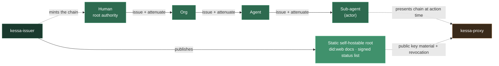
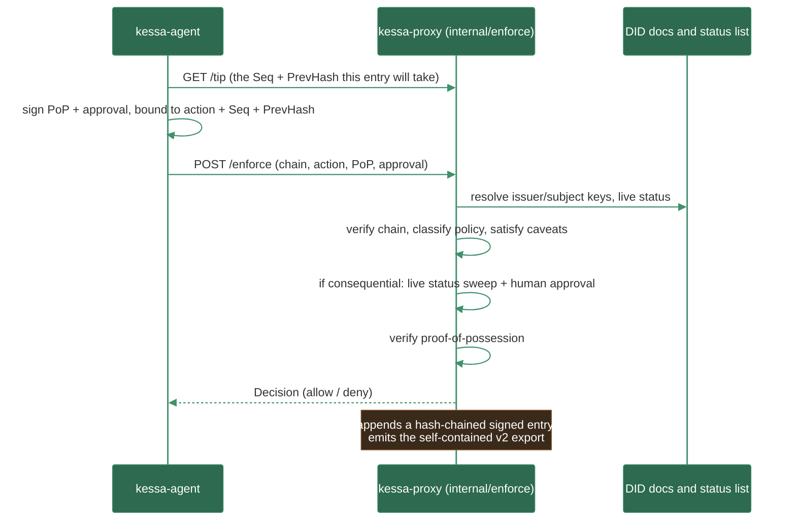
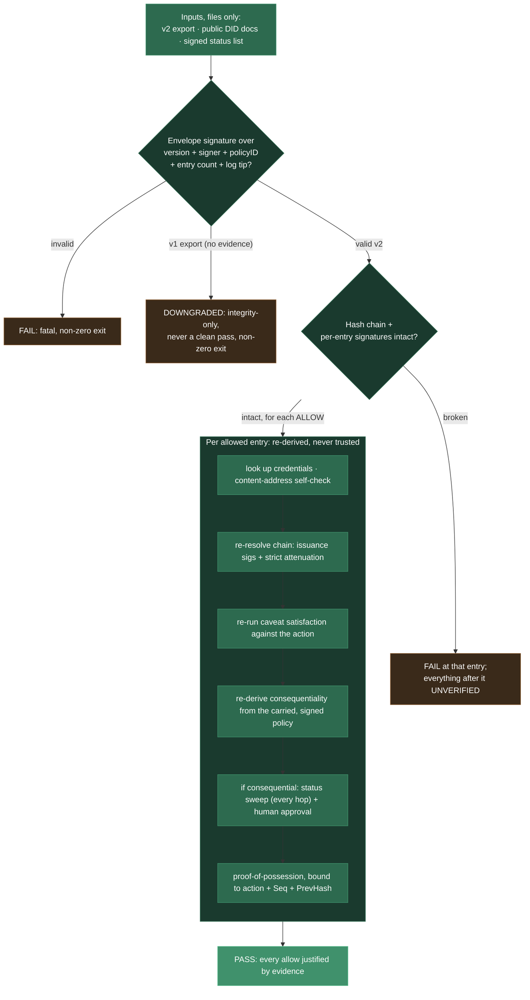

# How Kessa Works

The mechanics of the three-stage flow, and the precise statement of what a
clean verdict proves. For what the system is for and its known limits, see the
[README](../README.md).

## The three stages

Three binaries produce evidence and one re-checks it. The **issuer** mints an
attenuated delegation chain and publishes public artifacts; the **proxy** (with
the **agent** as its client) enforces every action and writes a signed,
hash-chained audit log; the **verifier** re-derives every verdict from that log
alone, trusting nothing of ours beyond public DID documents.

**1. Delegation and published artifacts.** A human delegates down a chain, each
hop strictly narrowing authority. The issuer publishes DID documents and a signed
status list into a static, self-hostable root, the only things a verifier ever
reads from "us".

**2. Enforcement at the proxy.** The agent binds its proof-of-possession and any
human approval to the exact action and the entry's chain position, then submits.
The proxy composes every check in one place and only then writes `Allowed: true`,
appending a signed entry to the v2 export.

**3. Independent verification.** The verifier consumes only files. It checks the
envelope signature, re-derives the hash chain, and for every *allowed* entry
re-runs the whole justification from the carried evidence, trusting the proxy's
assertions for nothing.

A proxy that cuts any corner produces an export the verifier rejects. That is the
whole point, and scenarios 1 to 7 (`make demo`) exercise it end to end.

## What a clean verdict actually proves

Deliberately narrow, because this is trust infrastructure:

> For every **allowed** action: it was within the delegated authority (caveats
> satisfied against the recorded action); the issuance chain is valid, reproduces
> the recorded principals, and covers **each credential in full**, so no field of
> a presented credential differs from what its issuer signed; holder possession
> was proven (bound to the action and the entry's chain position);
> consequentiality, the rule that fired, and the policy version were all
> **re-derived from the export's carried, signed policy** and match the entry's
> own claims; and if that re-derivation says the action is consequential, every
> hop whose issuer published a status list was checked, none is currently revoked,
> and a valid human approval (bound to the action and entry position) was
> obtained. The export's version, signer, policy identity, **entry count and log
> tip** are covered by the enforcement point's envelope signature.

Every field the verifier reads to reach a verdict is inside signed material it
re-derives rather than trusts: version, policy identity, and the log's length and
tip (envelope signature); consequentiality, rule attribution, and policy version
(re-run against the carried policy); every field of every presented credential
(the issuance signature covers the whole credential); the number of hops
status-checked (re-derived from that evidence, not read off the entry);
proof-of-possession and approval scope (bound to action + entry position); and
per-entry evidence identity (hash-covered credential IDs and `policyID`).

**That sentence was false twice over before round 2**, and the correction is the
point of stating it precisely. `StatusRef` sat outside the issuance signature, so
a holder could edit its own credential to skip the revocation check
(R2-01); `statusChecked` was an assertion the verifier accepted rather than a
count it re-derived; and the envelope signature bound nothing about the log's
length, so a genuine export could be truncated by anyone holding the file
(R2-02). Both are closed; the consolidated [security review](README.md#security-review)
records the fixes.

**The keys those signatures are checked against are trusted input.** No amount of
re-derivation changes that. It is the first entry under [Known
limits](../README.md#known-limits) rather than a footnote.
